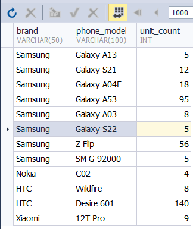

# Базы данных и SQL (семинары)
##  Установка СУБД, подключение к БД, просмотр и создание таблиц

## Содержание

[Задание 1](#задание-1)<br>
[Задание 2](#задание-2)<br>
[Задание 3](#задание-3)<br>
[Задание 4](#задание-4)

### Задание 1

Создайте таблицу с мобильными телефонами, используя графический интерфейс. Заполните БД данными. Добавьте скриншот на платформу в качестве ответа на ДЗ

Создадим таблицу для хранения информации о телефонах

```SQL
USE sql_gb_01;

CREATE TABLE phone (
  phone_id int AUTO_INCREMENT PRIMARY KEY NOT NULL, -- идентификатор
  brand varchar(50) NOT NULL,                       -- марка
  phone_model varchar(100) NOT NULL,                -- модель телефона
  price numeric(10,2) DEFAULT (0.0),                -- цена за единицу
  unit_count int DEFAULT(0),                        -- количество в наличии
  full_cost numeric(10,2) DEFAULT(0.0)              -- общая стоимость
)
```

Заполним ее данными

```SQL
INSERT INTO phone 
    (brand, phone_model, price, unit_count, full_cost)
  VALUES 
    ('Samsung', 'Galaxy A13', 25000, 5, 25000*5),
    ('Samsung', 'Galaxy S21', 38000, 12, 38000*12),
    ('Samsung', 'Galaxy A04E', 23000, 18, 23000*18),
    ('Samsung', 'Galaxy A53', 18000, 95, 18000*95),
    ('Samsung', 'Galaxy A03', 21000, 8, 21000*8),
    ('Samsung', 'Galaxy S22', 45000, 5, 45000*5),
    ('Samsung', 'Z Flip', 68000, 56, 68000*56),
    ('Samsung', 'SM G-92000', 15000, 5, 15000*5),
    ('Nokia', 'C02', 12000, 4, 12000*4),
    ('HTC', 'Wildfire', 8000, 8, 8000*8),
    ('HTC', 'Desire 601', 6000, 140, 6000*14),
    ('HTC', 'U20 5G', 62000, 2, 62000*2),
    ('Xiaomi', '12T Pro', 36000, 9, 36000*9);
```
  
Пример заполнения таблицы


### Задание 2

Выведите название, производителя и цену для товаров, количество которых превышает 2 (SQL - файл, скриншот, либо сам код)

```SQL
SELECT
  brand, phone_model, price
FROM phone 
WHERE unit_count > 2
```

Выполнение запроса



### Задание 3

Выведите весь ассортимент товаров марки “Samsung”

```sql
USE sql_gb_01;

SELECT brand, phone_model 
FROM phone
WHERE brand = 'samsung';
```

Выполнение скрипта


### Задание 4*

Выведите информацию о телефонах, где суммарный чек больше 100 000 и меньше 145 000

```sql
USE sql_gb_01;

SELECT brand, phone_model, full_cost 
FROM phone
WHERE full_cost BETWEEN 100000.00 AND 145000.00 ;
```
Выполнение запроса


С помощью регулярных выражений найти (можно использовать операторы “LIKE”, “RLIKE для 4.3” )

**Товары, в которых есть упоминание "Iphone"**

```sql
USE sql_gb_01;

SELECT
  brand,
  phone_model,
  price
FROM phone
WHERE phone_model LIKE '%iphone%';
```

В даной базе данных данный товар отсутствует

**"Galaxy"**

```sql
USE sql_gb_01;

SELECT
  brand,
  phone_model,
  price
FROM phone
WHERE phone_model LIKE '%galaxy%';
```

Выполнение запроса


**Товары, в которых есть ЦИФРЫ**

```sql
USE sql_gb_01;

SELECT
  brand,
  phone_model,
  price
FROM phone
WHERE phone_model RLIKE '[0-9]';
```
Выполнение запроса


**Товары, в которых есть ЦИФРА "8"**

```sql
USE sql_gb_01;

SELECT
  brand,
  phone_model,
  price
FROM phone
WHERE phone_model RLIKE '[8]';
```

Данные товары отсутствуют, выборка пуста

